# 🚀 Research Pilot AI

<div align="center">
  
  [](https://streamlit.io)
  [](https://ai.google.dev)
  [](https://en.wikipedia.org/wiki/Retrieval-augmented_generation)
  [](https://langchain.com)
  [](https://faiss.ai)
  

  
  *Analyze, compare, and synthesize research papers using cutting-edge AI technology!*
  
</div>

## 🌟 Features

<div align="center">
  
  | 🧠 **Smart Q&A** | 📊 **Paper Comparison** | ✍️ **Literature Review** |
  |:---------------------:|:----------------------:|:--------------------------:|
  | AI-powered question answering | Methodology analysis & comparison | Auto-generate academic reviews |
  | Context-aware responses | Side-by-side evaluation | Multi-paper synthesis |
  
  | 📈 **Dataset Extraction** | 💾 **Workspace Manager** | 🎯 **Question Suggestions** |
  |:----------------------:|:-----------------------:|:---------------------------:|
  | Detect datasets & metrics | Save & load sessions | AI-generated smart questions |
  | Structured output tables | Version control | Context-based recommendations |
  
</div>

## ✨ What makes Research Pilot AI special?

- **🧠 RAG-Powered Intelligence** - Retrieval-Augmented Generation ensures accurate, source-backed answers
- **🤖 Gemini AI Integration** - Google's latest Gemini 2.5 Flash model for lightning-fast analysis
- **📚 Multi-Paper Support** - Upload and analyze multiple research papers simultaneously
- **🔍 Smart Extraction** - Automatically identify datasets, metrics, and methodologies
- **📊 Structured Comparison** - Side-by-side methodology analysis with detailed tables
- **✍️ Literature Reviews** - Generate cohesive academic literature reviews from multiple papers
- **💾 Session Persistence** - Save your work and continue later with workspace management
- **🎯 Intelligent Suggestions** - AI-generated questions based on uploaded paper content
- **🎨 Modern UI** - Beautiful, gradient-themed interface with dark mode aesthetics

## 🚀 Quick Start

### Prerequisites

```bash
# Python 3.9 or higher
python --version

# pip package manager
pip --version
```

### Installation

**Clone the repository**
   ```bash
   git clone https://github.com/yourusername/research-pilot-ai.git
   cd research-pilot-ai
   ```

**Install dependencies**
   ```bash
   pip install streamlit
   pip install langchain langchain-community
   pip install faiss-cpu
   pip install sentence-transformers
   pip install google-generativeai
   pip install PyMuPDF
   pip install python-dotenv
   ```

**Set up API credentials**
   ```bash
   # Create a .env file in the root directory
   echo "GEMINI_API_KEY=your_api_key_here" > .env
   ```
   
   Get your Gemini API key from [Google AI Studio](https://ai.google.dev)

**Run the application**
   ```bash
   streamlit run app.py
   ```

**Open your browser**
   - Navigate to `http://localhost:8501`
   - Start uploading papers and analyzing!

## 🛠️ Tech Stack

<div align="center">
  
  
  
  
  
  
  
</div>

### Core Technologies

- **Web Framework**: Streamlit (Interactive web application with real-time updates)
- **AI Model**: Google Gemini 2.5 Flash (Fast, accurate, and context-aware responses)
- **RAG Framework**: LangChain (Retrieval-Augmented Generation pipeline)
- **Vector Database**: FAISS (Efficient similarity search and clustering)
- **Embeddings**: HuggingFace all-MiniLM-L6-v2 (Semantic text embeddings)
- **PDF Processing**: PyMuPDF (Fast and reliable PDF text extraction)

## 💡 How It Works

### System Architecture

```mermaid
graph TD
    A[📄 PDF Upload] --> B[🔍 Text Extraction]
    B --> C[✂️ Text Chunking]
    C --> D[🧮 Embedding Generation]
    D --> E[💾 FAISS Vector Store]
    E --> F[🔎 Similarity Search]
    F --> G[🤖 Gemini AI]
    G --> H[💬 Intelligent Response]
    
    I[❓ User Question] --> F
    J[💾 Workspace Manager] --> K[📂 Session Storage]
    K --> L[🔄 Load/Save State]
    
    style A fill:#4ECDC4,stroke:#333,stroke-width:2px,color:#fff
    style G fill:#FF6B6B,stroke:#333,stroke-width:2px,color:#fff
    style E fill:#45B7D1,stroke:#333,stroke-width:2px,color:#fff
    style H fill:#96CEB4,stroke:#333,stroke-width:2px,color:#fff
```



### Processing Pipeline

1. **📄 Document Upload** - User uploads one or more research papers in PDF format
2. **🔍 Text Extraction** - PyMuPDF extracts full text from each PDF document
3. **✂️ Text Chunking** - Documents are split into manageable chunks (800 chars, 200 overlap)
4. **🧮 Embedding Creation** - Chunks are converted to semantic vectors using HuggingFace embeddings
5. **💾 Vector Storage** - Embeddings are stored in FAISS for efficient retrieval
6. **❓ Query Processing** - User questions are embedded and matched against the vector store
7. **🔎 Context Retrieval** - Top-k most relevant chunks are retrieved based on similarity
8. **🤖 AI Generation** - Gemini AI generates answers using retrieved context
9. **💬 Response Delivery** - Formatted responses with source citations are displayed

## 🎮 Key Features Breakdown

### 🧠 Smart Q&A Assistant
- **Intelligent Question Answering**: Upload papers and ask any research question
- **Context-Aware Responses**: Answers are grounded in the actual paper content
- **Source Citations**: Each answer includes references to source papers
- **Question Suggestions**: AI generates relevant questions based on paper content
- **Conversation History**: Track all questions and answers in your session

### 📊 Paper Comparison Engine
- **Single Paper Analysis**: Deep dive into methodology, datasets, and metrics
- **Two-Paper Comparison**: Side-by-side methodology comparison with detailed tables
- **Structured Output**: Clean, readable Markdown tables for easy comparison
- **Comprehensive Coverage**: Analyzes algorithms, datasets, metrics, strengths, and limitations

### ✍️ Literature Review Generator
- **Multi-Paper Synthesis**: Generate cohesive reviews from multiple papers
- **Academic Tone**: Formal, scholarly writing style
- **Theme Identification**: Automatically identifies common themes and differences
- **Research Gaps**: Highlights opportunities for future research
- **Exportable Output**: Download reviews as TXT files

### 📈 Dataset & Metric Extractor
- **Automated Detection**: Identifies all datasets and metrics mentioned in papers
- **Structured Tables**: Presents findings in clear, organized tables
- **Context Included**: Shows example mentions and usage context
- **Consolidated Summary**: Cross-paper analysis of common datasets and metrics
- **Domain Classification**: Categorizes datasets by domain and type

### 💾 Workspace Management
- **Session Saving**: Save your entire research session with all history
- **Version Control**: Multiple saves with timestamps - never lose work
- **Load Previous Sessions**: Continue exactly where you left off
- **Export/Import**: Share workspaces or backup to external storage
- **Selective Clearing**: Clear current session or delete all workspaces


## 🎯 Usage Examples

### Example 1: Research Question Answering

```python
# Upload your research papers (PDF files)
# → The system automatically indexes them

# Ask questions like:
"What machine learning algorithms are used in these papers?"
"Compare the datasets used across all uploaded papers"
"What are the main limitations mentioned?"
"How do the evaluation metrics differ?"
```

### Example 2: Paper Comparison

```python
# Upload two research papers
# → Select "Compare Two Papers" mode

# The system will automatically generate a comparison table:
| Aspect | Paper 1 | Paper 2 | Key Difference |
|--------|---------|---------|----------------|
| Algorithm | CNN-LSTM | Transformer | Architecture approach |
| Dataset | ImageNet | COCO | Image vs Object focus |
| Metrics | Accuracy, F1 | mAP, IoU | Classification vs Detection |
```

### Example 3: Literature Review

```python
# Upload 3+ research papers
# → Select "Literature Review Generator"

# Output format:
"""
Recent advances in deep learning for computer vision have focused on...
[Paper1] introduced a novel architecture that... while [Paper2] explored...
Key differences emerge in their approaches to... Common themes include...
Future research opportunities exist in...
"""
```

## 🤝 Contributing

Contributions are welcome to enhance Research Pilot AI!

1. **🍴 Fork the repository**

2. **🌟 Create your feature branch**
   ```bash
   git checkout -b feature/EnhancedExtraction
   ```

3. **💻 Commit your changes**
   ```bash
   git commit -m 'Add multi-language support for PDFs'
   ```

4. **🚀 Push to the branch**
   ```bash
   git push origin feature/EnhancedExtraction
   ```

5. **📬 Open a Pull Request**


## 🎓 Educational Value

This project demonstrates key concepts in:

- **Natural Language Processing**: Text extraction, chunking, and embedding generation
- **Retrieval Systems**: Vector databases, similarity search, and ranking
- **Generative AI**: Large language models, prompt engineering, RAG pipelines
- **Web Development**: Streamlit, interactive UI, state management
- **API Integration**: External AI services, retry logic, error handling
- **Data Management**: Session persistence, import/export, version control

## 🔒 Privacy & Security

- **Local Processing**: PDF text extraction happens locally
- **API Communication**: Only text chunks are sent to Gemini API
- **No Data Storage**: Papers are not stored permanently unless you save workspace
- **Workspace Control**: Full control over saved sessions and deletion
- **API Key Security**: Environment variables protect your credentials

## 📮 Future Roadmap

- 🌐 **Multi-Language Support** - Process papers in languages beyond English
- 📊 **Visual Analytics** - Charts and graphs for dataset/metric trends
- 🔗 **Citation Network** - Visualize paper relationships and citations
- 🎯 **Custom Templates** - User-defined comparison and review templates
- 🤝 **Collaborative Mode** - Share workspaces with team members
- 📱 **Mobile App** - iOS and Android versions for on-the-go research
- 🔊 **Audio Summaries** - Generate podcast-style paper summaries
- 🎨 **Diagram Extraction** - Extract and analyze figures and tables
- 🧠 **Advanced RAG** - Hybrid search with keyword + semantic retrieval
- ⚡ **Batch Processing** - Process dozens of papers simultaneously


---

<div align="center">
  
  **Made by researchers, for researchers**
  
  *Empowering academic research through AI*
  

  
</div>

---

*Last updated: January 2026*